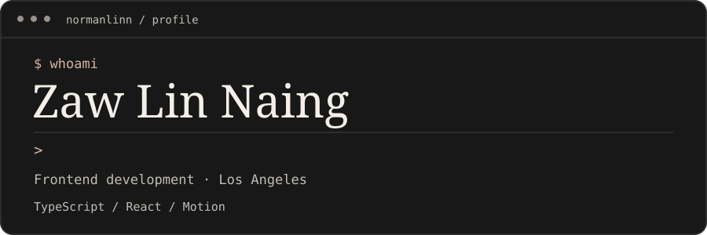

[**Portfolio ↗**](https://normanlinn.github.io/portfolio/) · [**Repositories ↗**](https://github.com/normanlinn?tab=repositories)

I’m Norman, a frontend developer in Los Angeles. I build web apps for everyday problems and experiment with how motion can make an interface easier to use.

## Selected work

| Project | What it does | Explore |
| :--- | :--- | :--- |
| **LAXCommute** | Helps LAX employees find shuttle routes and check arrivals. | [Live app](https://employeeshuttlelax.com/) · [Source](https://github.com/normanlinn/LAXCommute) |
| **Yay Kyaw Nights** | A 3D browser game inspired by Yangon’s night fairs. | [Play](https://yaykyawfair.vercel.app/) · [Source](https://github.com/normanlinn/yaykyawfair) |
| **Derivatives Field Guide** | Makes calculus easier to practice with interactive graphs and worked examples. | [Study guide](https://calculus-study-site.vercel.app/) · [Source](https://github.com/normanlinn/calculus-study-site) |
| **Burman Tea** | A bilingual website for a Burmese tea shop in Los Angeles. | [Visit site](https://burmantea.vercel.app/) |

## At my desk

**Building with:** TypeScript, React, Next.js, CSS, and Framer Motion  
**Exploring:** Accessible motion, design systems, and backend development with Node.js and Go  
**Background:** C# and .NET

